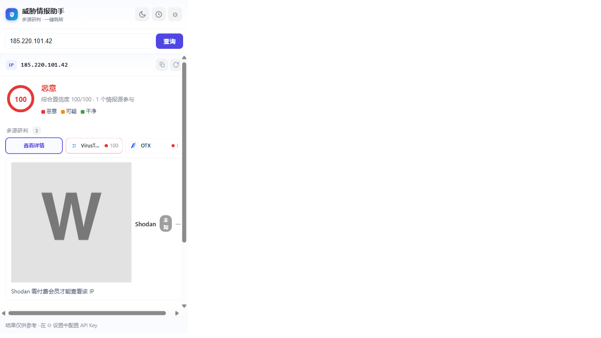
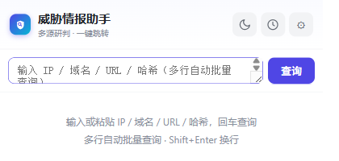
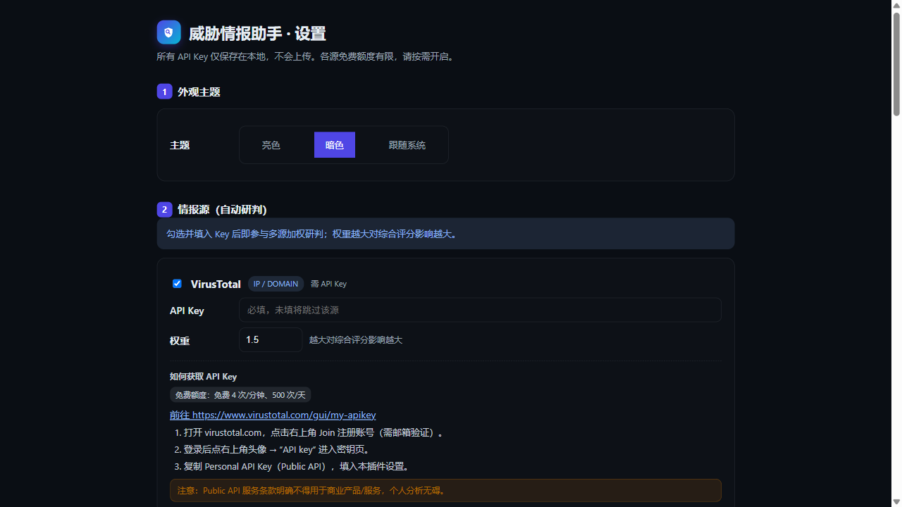

<p align="center">
  
</p>

<h1 align="center">星川威胁情报助手</h1>

<p align="center">
  <strong>XingChuan Threat Intelligence</strong>
</p>

<p align="center">
  划词识别 IP/域名，多源威胁情报加权研判 + 一键跳转国内主流情报平台
</p>

<p align="center">
  
  
  
  
  
</p>

---

## ✨ 功能特性

- **🔍 划词即查**：选中 IP/域名/URL/哈希，旁边出现「情报查询」浮窗按钮，点击聚合多个情报源结果
- **📊 多源研判**：6 个情报源并行查询，加权综合评分（恶意/可疑/干净），透明展示每个源的贡献
- **📦 批量查询**：粘贴多行 IOC，自动批量查询并汇总表格，支持导出 CSV
- **🔗 一键跳转**：17 个国内外情报平台，点击图标直达详情页（无需任何 Key）
- **🎨 亮/暗主题**：一键切换，设置页可选"跟随系统"
- **📋 配置导入导出**：备份/恢复配置，支持导出含/不含 Key
- **🔒 安全优先**：API Key 仅存本地，零遥测，代码可审计

## 📸 截图

<p align="center">
  
  <br><em>亮色弹窗：恶意 IP 多源研判</em>
</p>

<p align="center">
  
  <br><em>暗色弹窗：恶意 IP 多源研判</em>
</p>

<p align="center">
  
  <br><em>亮色弹窗：初始状态</em>
</p>

<p align="center">
  
  <br><em>设置页：情报源配置 + API 申请指引</em>
</p>

## 🚀 快速开始

### 安装

1. **下载**：从 [Releases](https://github.com/xingchuan/xingchuan-ti/releases) 下载最新 `xingchuan-ti-x.x.x-chrome.zip`
2. **解压**：解压到任意目录
3. **加载**：Chrome 打开 `chrome://extensions` → 开启「开发者模式」→「加载已解压的扩展程序」→ 选择解压后的目录

### 配置 API Key

1. 点击扩展图标 → ⚙ 设置
2. 在各情报源下填入你的 API Key（设置页内置申请指引）
3. 修改自动保存，无需点保存按钮

### 使用

- **划词查询**：选中 IP/域名/URL/哈希 → 点击浮窗按钮
- **右键查询**：选中文本 → 右键 →「威胁情报查询」
- **工具栏**：点击扩展图标 → 输入框查询（支持多行批量查询）
- **批量查询**：在弹窗输入框粘贴多行 IOC（每行一个），自动进入批量模式，点击行可查看详情
- **导出 CSV**：批量查询结果页点击「导出 CSV」按钮

## 🧩 情报源

### 自动研判（需配置 Key）

支持的指标类型：**IP**（v4/v6）、**域名**、**URL**（自动提取域名查询）、**文件哈希**（MD5/SHA1/SHA256）

| 源 | 类型 | 免费额度 | 备注 |
|---|---|---|---|
| [VirusTotal](https://www.virustotal.com/) | IP + 域名 + 哈希 | 4次/分、500次/天 | Public API |
| [AbuseIPDB](https://www.abuseipdb.com/) | IP | 1000次/天 | 滥用举报置信度 |
| [AlienVault OTX](https://otx.alienvault.com/) | IP + 域名 | 宽松（免费） | Key 可选 |
| [Shodan](https://www.shodan.io/) | IP | 1次/秒 | 富化（端口/漏洞），CVSS 评分 |
| [GreyNoise](https://www.greynoise.io/) | IP | ~50次/周 | 区分扫描器性质 |
| [微步在线](https://x.threatbook.com/) | IP + 域名 | ~10次/天 + 100次/月 | 国内唯一明确免费 |
| [urlscan.io](https://urlscan.io/) | IP + 域名 + URL | ~100次/天 | 免费，Key 可选（提高限额） |
| [ThreatFox](https://threatfox.abuse.ch/) | IP + 域名 + URL + 哈希 | 免费 | C2 IOC 质量极高，需 Auth-Key |
| [MalwareBazaar](https://bazaar.abuse.ch/) | 哈希 + 域名 | 免费 | 恶意样本关联，需 Auth-Key |
| [Censys](https://search.censys.io/) | IP | 免费层有额度 | 与 Shodan 互补，需 API Key |

### 一键跳转（无需 Key）

**国内**：微步、奇安信、长亭、腾讯 TIX、360、绿盟、安恒、站长之家、IP138

**国外**：VirusTotal、AbuseIPDB、AlienVault OTX、Shodan、Censys、GreyNoise、urlscan.io、SecurityTrails

## 🏗️ 技术架构

```
xingchuan-ti/
├── entrypoints/          # WXT 入口
│   ├── background.ts     # 编排器：并发查源 + 限流 + 缓存 + 加权评分
│   ├── content.ts        # 划词检测 + 浮动按钮 + Shadow DOM 面板
│   ├── popup/            # 工具栏弹窗（查询/研判/历史）
│   └── options/          # 设置页（配置/指引/导入导出）
├── src/
│   ├── adapters/         # 统一 Adapter 接口 + 6 个情报源适配器
│   ├── lib/              # 核心库：detect/storage/score/platforms/rateLimit/cache/http/messaging
│   └── ui/               # 渲染层：panel(结果面板) + css(设计系统) + dom(工具函数)
├── public/icons/         # 扩展图标 + 17 个平台 favicon
├── scripts/              # 构建脚本：图标抓取、截图
└── test/                 # 测试：逻辑单测 + 适配器单测 + 真实 Key 联网 + E2E
```

**技术栈**：WXT + TypeScript + 原生 CSS（无框架依赖）

## 🧪 测试

```bash
npm test                # 逻辑单测（识别/评分/跳转）
npm run test:adapters   # 适配器解析单测 + OTX 真实联网
npm run test:e2e        # 真实扩展端到端（需桌面 GUI）
npm run test:popup      # 弹窗输入框数量验证
npm run test:live       # 真实 Key 联网（VT_KEY=xxx npm run test:live）
npm run typecheck       # TypeScript 类型检查
```

## 🔧 开发

```bash
npm install             # 安装依赖
npm run dev             # 开发模式（热重载）
npm run build           # 生产构建
npm run zip             # 打包 zip
npm run icons           # 重新抓取平台 favicon
```

## 🔒 安全与隐私

- **API Key 仅保存在本地** `chrome.storage.local`，不上传、不遥测、不外发
- **不收集任何查询记录**（缓存仅存 `chrome.storage.session`，关闭浏览器即清）
- **全部源码可审计**；本扩展不内置任何有效 Key
- **配置导出**：支持导出含/不含 Key（含 Key 文件敏感，勿公开分享）

## ⚖️ 免责声明

仅供安全研究与授权分析使用。各情报平台 API 有各自的服务条款（如 VirusTotal Public API 不得用于商业产品），使用前请阅读并遵守。判定结果仅供参考，最终判断请结合多方情报与上下文。

## 📄 许可证

[MIT](LICENSE)

## 🙏 致谢

- [WXT](https://wxt.dev/) - 现代浏览器扩展开发框架
- [VirusTotal](https://www.virustotal.com/) - 恶意软件分析平台
- [AbuseIPDB](https://www.abuseipdb.com/) - IP 滥用举报数据库
- [AlienVault OTX](https://otx.alienvault.com/) - 开源威胁情报社区
- [Shodan](https://www.shodan.io/) - 互联网设备搜索引擎
- [GreyNoise](https://www.greynoise.io/) - 互联网噪声分析
- [微步在线](https://x.threatbook.com/) - 国内威胁情报平台
